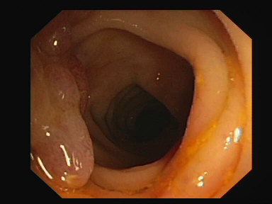
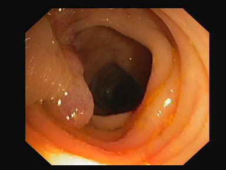

# CVC-ClinicDB (CVC-612)

The dataset contains the image extracted from the colonoscopy videos. These image contains different types polyps. The dataset also include the ground-truth for those images.
  
You can download the dataset from <a href="https://polyp.grand-challenge.org/CVCClinicDB/">here<a/> or from directly from the <a href="https://www.dropbox.com/s/p5qe9eotetjnbmq/CVC-ClinicDB.rar?dl=0">Dropbox</a>.
## Sample Image and Masks
   
   
   
  
  
