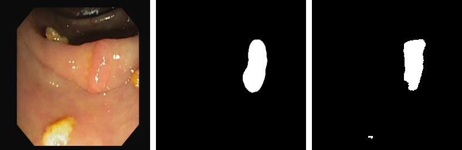
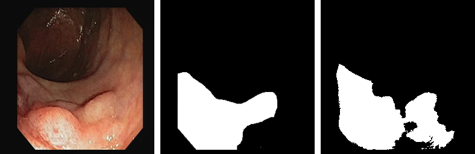

# Polyp-Segmentation-using-UNET-in-TensorFlow-2.0

Implementing polyp segmentation using the U-Net and CVC-612 dataset.  
Blog Post: https://idiotdeveloper.com/polyp-segmentation-using-unet-in-tensorflow-2/  
Video Explaination: [https://youtu.be/SOkXeGLa2qo](https://youtu.be/SOkXeGLa2qo)
 
 
The dataset CVC-ClinicDB (CVC-612) is not complete. Download it from the <a href="https://polyp.grand-challenge.org/CVCClinicDB/"> Here </a> 
 & <a href="https://www.dropbox.com/s/p5qe9eotetjnbmq/CVC-ClinicDB.rar?dl=0"> Dropbox Link </a>

## Results
The images given below are in the sequence: (1) Input Image, (2) Ground Truth, (3) Predicted Mask   

